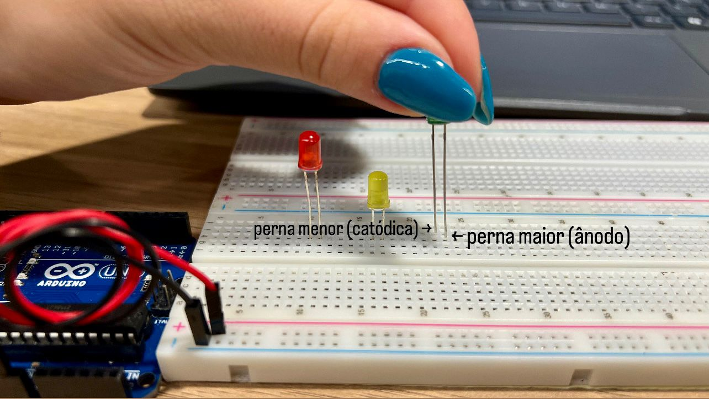

# Projeto: Semáforo Inteligente - Marcela Costa

Este repositório documenta o desenvolvimento de um protótipo de semáforo funcional, como parte do desafio proposto pelo Departamento de Engenharia de Trânsito. O objetivo é controlar o fluxo em uma via movimentada, garantindo a segurança de pedestres e veículos através da correta montagem e programação das fases do semáforo.

## Componentes Utilizados

Para a realização deste projeto, foram utilizados os seguintes componentes:

| Componente | Quantidade | Especificação / Observação |
| :--- | :---: | :--- |
| Arduino UNO | 1 | Placa controladora |
| Cabo USB | 1 | Para alimentação e programação |
| LED Vermelho | 1 | 5mm |
| LED Amarelo | 1 | 5mm |
| LED Verde | 1 | 5mm |
| Resistores | 3 | 330 Ohms (Laranja-Laranja-Marrom) |
| Jumpers (fios) | 5 | Macho-Macho |
| Protoboard | 1 | 1560 pontos |

---

## Parte 1: Montagem Física do Semáforo

A montagem foi realizada seguindo um esquema padrão para garantir a organização e o correto funcionamento dos LEDs.

### Passo 1: Organização dos Componentes
Separação de todos os componentes necessários para a montagem.

<div align="center">
<p>Componentes do Projeto</p>

<p>Material produzido por: Marcela</p>
</div>

### Passo 2: Alimentação da Protoboard
O primeiro passo é energizar as linhas de alimentação da protoboard.
- Conectar um jumper vermelho do pino **5V** do Arduino para a **linha positiva (+)** da protoboard.
- Conectar um jumper preto do pino **GND** (Terra) do Arduino para a **linha negativa (-)** da protoboard.

<div align="center">
<p>Alimentação da Protoboard</p>

<p>Material produzido por: Marcela</p>
</div>

### Passo 3: Posicionando os LEDs
Os LEDs foram posicionados na protoboard, seguindo a ordem padrão (vermelho, amarelo, verde).
- **Justificativa:** É crucial observar a polaridade dos LEDs. O terminal maior (ânodo) é o positivo (+) e o menor (cátodo) é o negativo (-). Na montagem, deixamos todos os terminais positivos (ânodos) voltados para o lado direito, para facilitar a conexão com os pinos do Arduino. Obeserve a imagem para referência.

<div align="center">
<p>Posicionamento dos LEDs na Protoboard</p>

<p>Material produzido por: Marcela</p>
</div>

### Passo 4: Conectando os Pinos de Controle (Sinal)
Conectar os terminais positivos (ânodos) dos LEDs aos pinos digitais do Arduino, que enviarão o sinal para acendê-los.
- O pino digital **0** do Arduino foi conectado ao **ânodo (+) do LED vermelho.**
- O pino digital **1** do Arduino foi conectado ao **ânodo (+) do LED amarelo.**
- O pino digital **2** do Arduino foi conectado ao **ânodo (+) do LED verde.**

<div align="center">
<p>Conexão dos LEDs aos Pinos do Arduino</p>

<p>Material produzido por: Marcela</p>
</div>

### Passo 5: Conectando os Resistores (Proteção)
Para limitar a corrente elétrica e proteger os LEDs (evitando que queimem), conecte um resistor de 330 Ohms para cada LED.
- **Justificativa:** Os resistores são conectados entre o terminal **negativo (cátodo)** de cada LED e a **linha negativa (-)** geral da protoboard (GND). Isso "fecha" o circuito de forma segura.

<div align="center">
<p>Conexão dos Resistores</p>

<p>Material produzido por: Marcela</p>
</div>

### Passo 6: Montagem Concluída
Com todas as conexões feitas, o circuito está pronto para receber o código.

<div align="center">
<p>Semáforo Pronto para receber o código</p>

<p>Material produzido por: Marcela</p>
</div>

---

## Parte 2: Programação e Lógica do Semáforo

O comportamento do semáforo foi programado na IDE do Arduino e segue a lógica de tempo solicitada:

- **6 segundos** no Vermelho (Parada total)
- **4 segundos** no Verde (Siga)
- **2 segundos** no Amarelo (Atenção)

Este ciclo se repete devido a função `loop()`. Abaixo está o código utilizado para controlar o semáforo:

<details>
  <summary>Ver código completo</summary>

```cpp
void setup()
{
  pinMode(0, OUTPUT); //vermelho
  pinMode (1, OUTPUT); //amarelo
  pinMode (2, OUTPUT); //verde
}

void loop()
{
  digitalWrite(0, HIGH); //acende o vermelho
  delay(6000); //espera 6 segundos
  digitalWrite(0, LOW); //apaga o vermelho
  
  digitalWrite(2, HIGH); //acende o verde
  delay(4000); //espera 4 segundos
  digitalWrite(2, LOW); //apaga o verde
  
  digitalWrite(1, HIGH); //acende o amarelo
  delay(2000); //espera 2 segundos
  digitalWrite(1, LOW); //apaga o amarelo
}

```
</details>

---

## Parte 3: Vídeo de Funcionamento

O vídeo abaixo demonstra a montagem física em operação, com os LEDs acendendo e apagando conforme os tempos programados, e demonstra a autoria do projeto.

`[Adicione aqui o link para o seu vídeo de funcionamento no GitHub, YouTube, Google Drive, etc.]`

---

## Parte 4: Avaliação de Pares

Conforme solicitado, esta seção registra os resultados das avaliações de pares realizadas por outros alunos.

*(Adicione aqui as tabelas ou prints das avaliações recebidas, incluindo os nomes completos dos avaliadores.)*

**Avaliador 1:**
- **Nome:**
- **Feedback:**

**Avaliador 2:**
- **Nome:**
- **Feedback:**